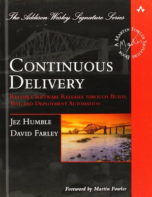
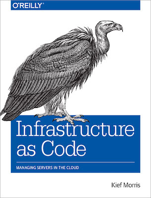

title: Continuous Delivery: Myths and Realities
class: animation-fade
layout: true


<!-- This slide will serve as the base layout for all your slides -->

---

class: impact

# {{title}}

---

class: impact center middle

## Mario Fernandez
 Lead Developer
 
 **Thought**Works

---

class: transition

# What is Continuous Delivery?

---

class: middle center

> Continuous Delivery is the ability to get changes of all types—including new features, configuration changes, bug fixes and experiments—into production, or into the hands of users, safely and quickly in a sustainable way.

.bottom-right[
### continuousdelivery.com/
]

---

class: center middle



---

class: transition

# Why Continuous Delivery?

---

class: center middle


.bottom-right[
### thoughtworks.com/radar/techniques/four­key­metrics
]

---

class: transition

# How to implement it?

---

class: center middle

# 5 Principles

---

class: center middle

## Build quality in

--

class: center middle

## Work in small batches

--

class: center middle

## Automation

--

class: center middle

## Continuous improvement

--

class: center middle

## Shared responsibility

???

- nice concepts, but on their own they don't have a lot of meaning

---

class: center middle

# That's not very concrete

---

class: center middle

# Let's try to get practical

???

- was talking to another former student of this program that now works at TW as well
- recommended a proper practical case from the industry

---

class: impact

# Case Study

---

class: impact

# Agile transformation in the automotive industry

---

portfolio context

---

class: transition

# Starting point

---

class: center middle

# March, 2018

---

class: full-width
background-image: url(images/team.png)

---

picture of multiple services

---

picture release process (including test systems)

---

class: full-width
background-image: url(images/thisisfine.png)

---

class: center middle

## Deployments every 2-4 weeks

--

## 1,5d regression testing before each deployment

--

## Many open bugs

--

## Unpredictable cadence

--

## Regular delays

---

class: transition

# Something had to change

---

class: center middle

# Many small improvements
## Over the course of roughly one year

---

class: center middle


---

class: transition

# #1 Delivery pipeline

---

class: center middle

# The code for the path to production is as important as the regular code

---

class: center middle

# Own your pipelines

---

class: center middle

# A good pipeline is code

.bottom-right[
### www.gocd.org/2017/05/02/what-does-pipelines-as-code-really-mean/
]

---

class: middle

```yaml
- name: test
  serial: true
  plan:
  - aggregate:
    - get: git
      passed: [prepare]
      trigger: true
    - get: dev-container
      passed: [prepare]
  - task: test-js
    image: dev-container
    params:
      <<: *common-params
      TARGET: js
    file: git/pipeline/tasks/tests/task.yml
```

---

```yaml
platform: linux
inputs:
  - name: git
caches:
  - path: git/node_modules
params:
  CI: true
  NPM_TOKEN:
  TARGET:
run:
  path: sh
  dir: git
  args:
  - -ec
  - |
    ../shared-tasks/scripts/install-yarn-packages.sh
    ./go test-${TARGET}
```

---

class: center middle

# Small, independent pipelines

---

class: full-width concourse
background-image: url(images/parallel.png)

---

class: center middle

# Let the tools help you

---

class: center middle

.image-grid[
.img[]
.img[]
.img[]
]

---

class: center middle

### thoughtworks.com/insights/blog/modernizing-your-build-pipelines

---

class: transition

# #2 Infrastructure

---

class: center middle


---

class: center middle

# How do you become faster by *adding* responsibilities to the team?

---

class: center middle

# DevOps mindset

---

class: center middle

# Autonomy


---

class: center middle

# Agility

---

class: center middle

# Leverage a larger community

---

class: center middle

# Yeah, but how?

---

class: center middle


---

class: center middle


---

terraform code snippet

---

picture of frontend being deployed to cdn

---

picture of backend being deployed to ECS

---

picture of support hero

---

class: center middle

# Owning your infrastructure makes it exponentially easier to deliver

---

class: transition

# #3 The Code

???

- notice how I didn't talk about the code we wrote yet

---

class: center middle

# TDD

---

picture of testing pyramid transition

---

class: center middle

# TBD

---

class: center middle

# Feature Toggles

.bottom-right[
### martinfowler.com/articles/feature-toggles.html
]

---

sample feature toggle

---

class: center middle

# Immutability

---

sample immutable code

---

class: center middle


---

class: transition

# Ending point

---

class: center middle

# May, 2019

---

class: full-width concourse
background-image: url(images/all-pipelines.png)

---

picture aws infra

---

class: center middle

.col-6.bad-practice[
### Deployments every 2-4 weeks
]

--

.col-6.good-practice[
### Multiple releases per day
]

--

.col-6.bad-practice[
### 1,5d regression testing
]

--

.col-6.good-practice[
### Continuous Deployment
]

--

.col-6.bad-practice[
### Many open bugs
]

--

.col-6.good-practice[
### Zero bug policy
]

--

.col-6.bad-practice[
### Unpredictable cadence
]

--

.col-6.good-practice[
### Fairly predictable
]

--

.col-6.bad-practice[
### Regular delays
]

--

.col-6.good-practice[
### Commitments reached
]

---

class: impact

# Conclusion

---

class: center middle

# Continuous Delivery can have a huge impact in the performance of a team

---

class: center middle

# It is not free. You have to invest to gain

---

class: center middle

# It is never done. You have to keep working and improving

---

class: impact

# Links

---

links go here

---

TW publicity?

---


