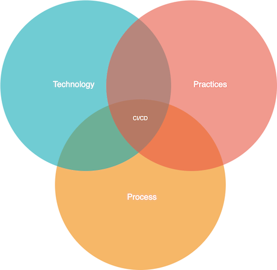
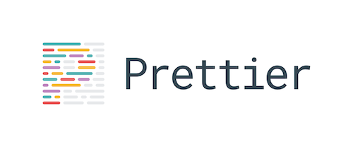

title: Continuous Delivery: Myths and Realities
class: animation-fade
layout: true


<!-- This slide will serve as the base layout for all your slides -->

---

class: impact full-width
background-image: url(images/background1.jpg)

.impact-wrapper[
# {{title}}
]

---

class: transition

## Mario Fernandez
 Lead Developer
 
 **Thought**Works
 
???

- part of the very first class

---

class: transition

# What is Continuous Delivery?

???

- let's make sure we are all on the same page before getting into details

---

class: middle center

> Continuous Delivery is the ability to get changes of all types—including new features, configuration changes, bug fixes and experiments—into production, or into the hands of users, safely and quickly in a sustainable way.

.bottom-right[
### continuousdelivery.com
]

---

class: center middle


???

- the bible
- jez humble, a former TWer

---

class: transition

# Why Continuous Delivery?

---

class: center middle


.bottom-right[
### thoughtworks.com/radar/techniques/four­key­metrics
]

???

- there is research that shows that high performing organizations practice CD in their day to day 

---

class: transition

# How to implement it?

---

class: center middle

# 5 Principles

---

class: center middle

## Build quality in

--

class: center middle

## Work in small batches

--

class: center middle

## Automation

--

class: center middle

## Continuous improvement

--

class: center middle

## Shared responsibility

???

- nice concepts, but on their own they don't have a lot of meaning

---

class: center middle

# *That's not very concrete*

???

- nothing to argue against these principles
- can we picture how to apply them, though?

---

class: center middle

# *Let's try to get practical*

???

- was talking to another former student of this program that now works at TW as well
- recommended a proper practical case from the industry

---

class: impact full-width
background-image: url(images/background2.jpg)

.impact-wrapper[
# Case Study
]

---

class: impact full-width
background-image: url(images/background3.jpg)

.impact-wrapper[
# Agile transformation in automotive
]

???

- I'm going to talk about a project is was part of, where I brought these principles to a team

---

class: transition

# Starting point

---

class: center middle

# March, 2018

---

class: full-width
background-image: url(images/team.png)

???

- agile team, part of a bigger portfolio
- client, us and other consultancies involved

---

class: center middle

# Multiple microservices with frontend and backend

???

- web applications for car owners to check the status of their vehicles basically

---

class: center middle


???

- claimed to do CI/CD, in practice the picture was grim

---

class: center middle


---

class: full-width
background-image: url(images/thisisfine.png)

---

class: center middle

## Deployments every 2-4 weeks

--

## Manual regression testing before each deployment

???

- day and a half in fact

--

## Many open bugs

???

- massively inconsistent ui

--

## Unpredictable cadence

???

- first big project I worked on was ongoing, sizings were hilariously inaccurate

--

## Regular delays

???

- same project was partially shipped with two quarters of delay

---

class: transition

# Something had to change

???

- client was not happy
- team members were not happy

---

class: center middle



???

- changes on all three areas were needed

---

class: center middle


???

- you'll see me talk about path to production over and over

---

class: transition

# Delivery pipeline
.counting[
# 1
]

???

- first area that we touched

---

class: center middle

# The code for the path to production is as important as the regular code

---

class: center middle

# Own your pipelines

---

class: center middle

# A good pipeline is code

.bottom-right[
### www.gocd.org/2017/05/02/what-does-pipelines-as-code-really-mean/
]

???

- no ui changes
- no XML dumps

---

class: middle

```yaml
- name: test
  serial: true
  plan:
  - aggregate:
    - get: git
      passed: [prepare]
      trigger: true
    - get: dev-container
      passed: [prepare]
  - task: test-js
    image: dev-container
    params:
      <<: *common-params
      TARGET: js
    file: git/pipeline/tasks/tests/task.yml
```

???

- this is a pipeline in concourse, the CI system we migrated to

---

```yaml
platform: linux
inputs:
  - name: git
caches:
  - path: git/node_modules
params:
  CI: true
  NPM_TOKEN:
  TARGET:
run:
  path: sh
  dir: git
  args:
  - -ec
  - |
    ../shared-tasks/scripts/install-yarn-packages.sh
    ./go test-${TARGET}
```

---

class: center middle

# Small, independent pipelines

???

- see the difference with what I showed before

---

class: center middle


???

- keyword: smaller batches

---

class: center middle

# Let the tools help you

---

class: center middle

.image-grid[
.img[]
.img[]
.img[]
.img[]
]

???

- using better tools save time and discussions
- keyword: automation
---

class: center middle

### thoughtworks.com/insights/blog/modernizing-your-build-pipelines

---

class: transition 

# Infrastructure
.counting[
# 2
]

???

- second major area to touch

---

class: center middle


???

- at this point our apps were still running on the ancient on prem infra
- we could not split FE/BE yet

---

class: center middle


???

- what does using the cloud have to do with doing CI/CD?
- in my experience, a lot

---

class: center middle

# How do you become faster by *adding* responsibilities to the team?

???

- the migration to the cloud was to be done by our team, with some support
- we would use the "you build it, you run it" principle

---

class: center middle

# **DevOps** mindset

???

- another buzzword
- what you build and how you run it is very much related

---

class: center middle

# Autonomy

???

- I don't have this autonomy in my current project, and it is making things painful

---

class: center middle

# Agility

---

class: center middle

# Leverage a larger community

???

- internal solutions tend to have few customers, and thus don't evolve much

---

class: center middle

# *Yeah, but how?*

---

class: center middle


.bottom-right[
### infrastructure-as-code.com
]

???

- another book I recommend, written by a colleague
- IaC means provisioning infrastructure through executable code
- Treat that code as regular code -> test, refactor

---

class: center middle


---

class: center middle

```hcl
resource "aws_ecs_cluster" "ecs-cluster" {
  name = "${var.ecs-cluster-name}"
}

resource "aws_autoscaling_group" "ecs-autoscaling-group" {
  name                      = "ecs-asg"
  launch_configuration      = "${aws_launch_configuration.config.name}"
  max_size                  = "${var.max-instance-size}"
  min_size                  = "${var.min-instance-size}"
}

resource "aws_launch_configuration" "config" {
  name_prefix          = "ecs-launch-configuration-"
  image_id             = "${data.aws_ami.latest_ecs_ami.id}"
}
```

???

- just to give you a taste, this provisions an ECS Cluster
- declarative instead of imperative

---

class: center middle


---

class: center middle


---

class: center middle

# Support hero


???

- a process change
- rotating responsibility of monitoring and checking the state of the infra through the team

---

class: center middle

# Owning your infrastructure makes it exponentially easier to deliver changes to your application

---

class: transition

# The Code
.counting[
# 3
]

???

- notice how I didn't talk about the code we wrote yet
- you _cannot_ truly implement CI/CD for a crappy legacy app

---

class: center middle

# Focus on simplicity

???

- predicting the future is hard
- build what you need now, not what you might need

---

class: center middle

# Design for Testability

???

- observable
- decomposable
- simple
- controllable

---

class: center middle

# TDD

???

- one of our favorite practices at TW
- many people claim to do it, and then never really follow through

---

class: center middle


---

class: center middle


---

class: center middle

# TBD

.bottom-right[
### trunkbaseddevelopment.com
]

???

- a less known acronym
- why? In order to move faster

---

class: center middle

# A deployment is *not* a release

???

- common misconception
- from the technical standpoint we want to have all our code on prod
- from the business side, certain features can only be released at specific points

---

class: center middle

# Feature Toggles

.bottom-right[
### martinfowler.com/articles/feature-toggles.html
]

---

class: center middle

```html
<section class="container">
  {{ service.label }}

* <app-feature-toggle-component featureToggleName="priceTag">
    <offer-price
      class="checkbox__label checkbox__label--inverted"
      [offerPrice]="service.price"
      [offerCurrency]="service.currency"
    ></offer-price>

  </app-feature-toggle-component>
</section>
```

???

- visual toggle, the user won't see a particular change

---

class: center middle

```kotlin
@RestController
@RequestMapping(PATH, consumes = [MediaType.APPLICATION_JSON_VALUE])
*@ConditionalOnExpression("\${pact.enabled:true}")
class PactController(val repository: Repository)
```

???

- toggles can (and should!) be also implemented from the BE side

---

class: center middle

# Declarative style

???

- switch the code to a more declarative style
- makes intentions clearer
- what instead of how

---

class: center middle

```java
private ImmutableList<Vin> vinLists(HttpHeaders httpHeaders) {
    return Arrays.asList(
            httpHeaders.getFirst(HEADER_USER_VINLIST),
            httpHeaders.getFirst(HEADER_SECOND_USER_VINLIST),
            httpHeaders.getFirst(HEADER_USER_EMPLOYEE)
        .stream()
        .map(header -> toVinList(header))
        .flatMap(l -> l.stream())
        .distinct()
        .collect(ImmutableList.toImmutableList());
}
```

???

- immutable objects and lists
- declarative operations

---

class: center middle


???

- as a consequence, we wanted to move from Java to Kotlin because it supported the style we wanted to use better
- keyword: continous improvement

---

class: transition

# Ending point

---

class: center middle


???

- I showed you this before, how did we fare?

---

class: center middle

# May, 2019

???

- as you can see, change takes time

---

class: full-width concourse
background-image: url(images/all-pipelines.png)

---

class: full-width concourse
background-image: url(images/parallel.png)

---

class: center middle

.col-6.bad-practice[
### Deployments every 2-4 weeks
]

--

.col-6.good-practice[
### Multiple deployments per day
]

--

.col-6.bad-practice[
### Manual regression testing
]

--

.col-6.good-practice[
### Continuous Deployment
]

--

.col-6.bad-practice[
### Many open bugs
]

--

.col-6.good-practice[
### Zero bug policy
]

--

.col-6.bad-practice[
### Unpredictable cadence
]

--

.col-6.good-practice[
### Fairly predictable
]

--

.col-6.bad-practice[
### Regular delays
]

--

.col-6.good-practice[
### Commitments reached
]

---

class: impact full-width
background-image: url(images/background4.jpg)

.impact-wrapper[
# Conclusion
]

---

class: center middle

# Continuous Delivery can have a huge impact in the performance of a team

---

class: center middle

# It is not free. You have to invest to gain

---

class: center middle

# It is never done. You have to keep working and improving

---

TW publicity?

---


